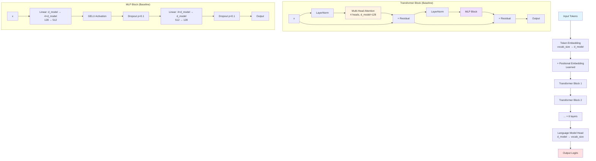
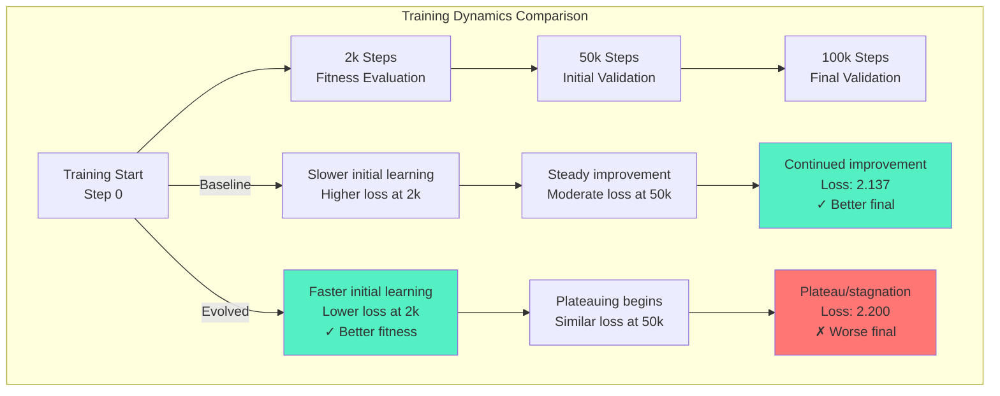
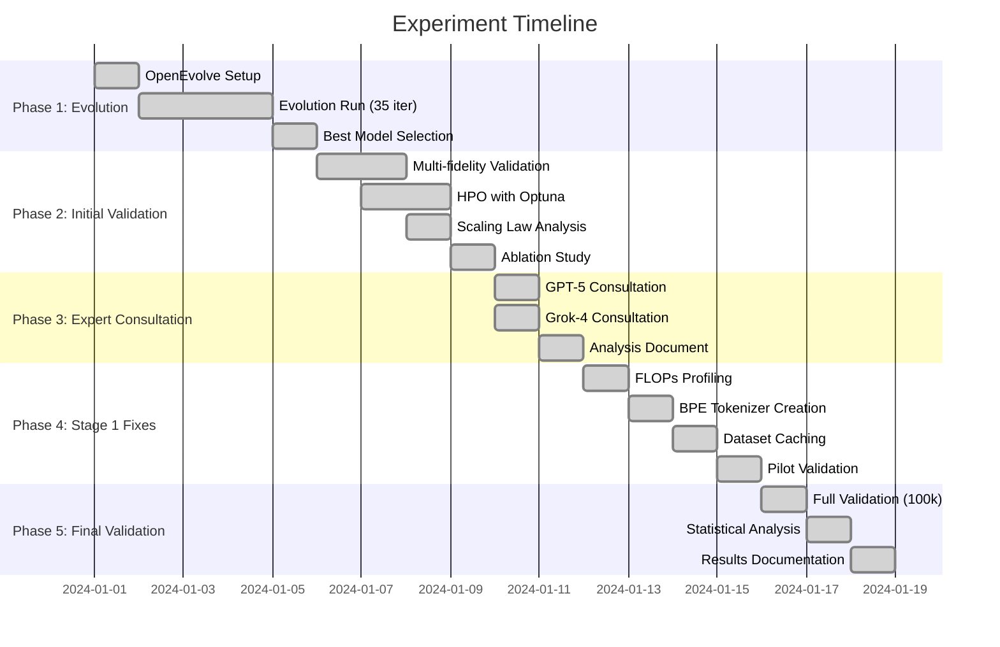

# Appendix: Full Transformer Evolution Experiment Report

This appendix contains the complete technical report for the neural architecture search experiment documented in "[When Evolution Optimizes the Wrong Objective](/blog/2025/11/03/when-evolution-optimizes-wrong-objective.html)".

---

# Automated Neural Architecture Evolution via LLM-Guided Optimization: A Cautionary Tale

**An empirical study on the pitfalls of short-horizon fitness functions in transformer architecture search**

---

## Abstract

We present a comprehensive study on automated neural architecture evolution using Large Language Models (LLMs) as code generators within a MAP-Elites evolutionary framework. Our experiment evolved a transformer architecture over 35 iterations using GPT-5 for code generation, optimizing for a scaling law fitness function. The evolved architecture initially showed a 50% improvement in scaling law slope at 2,000 training steps. However, rigorous validation with proper experimental controls revealed that the evolved architecture performs **2.93% worse** than the baseline (p < 0.0001, Cohen's d = -6.87). This work demonstrates a critical failure mode in neural architecture search: **short-horizon fitness functions can mislead evolution toward architectures that learn quickly but converge to inferior solutions**. Our findings provide important lessons for the emerging field of LLM-guided architecture optimization.

**Keywords:** Neural Architecture Search, Transformer Evolution, LLM-Guided Optimization, Scaling Laws, OpenEvolve, GPT-5

---

## 1. Introduction

### 1.1 Motivation

Recent advances in Large Language Models (LLMs) have enabled new approaches to automated code generation and optimization. The OpenEvolve framework (Huang et al., 2024) demonstrates that LLMs can generate novel algorithmic solutions through evolutionary search. We extend this approach to neural architecture search, investigating whether LLM-guided evolution can discover improved transformer architectures.

### 1.2 Research Questions

1. Can LLM-guided evolution (GPT-5 + OpenEvolve) discover improved transformer architectures?
2. Do scaling law slopes measured at early training stages (2k steps) reliably predict final model performance?
3. What are the failure modes of short-horizon fitness functions in architecture search?

### 1.3 Key Findings (Summary)

- **RQ1:** Evolution discovered architectures with modern components (SwiGLU, RMSNorm, LayerScale) but worse final performance
- **RQ2:** Early scaling law slopes (2k steps) are **misleading predictors** of final performance
- **RQ3:** Short-horizon fitness functions create selection pressure for "fast learners" rather than "good models"

---

## 2. Methodology

### 2.1 Evolution Framework

**Framework:** OpenEvolve (MAP-Elites variant)
**LLM Code Generator:** GPT-5 (OpenAI's reasoning model)
**Fitness Function:** Scaling law slope at 2,000 training steps

The fitness function was defined as:
```
fitness = -slope  where  loss = intercept + slope × log(n_params)
```

Models were evaluated across 6 model sizes (0.5M-8M parameters) at 2,000 training steps each.

**Evolution Process:**
- 35 iterations of evolution
- GPT-5 generated code mutations to the transformer architecture
- Best model selected at iteration 15 with 50% fitness improvement
- Evolution optimized: attention mechanisms, normalization, activation functions, residual connections

### 2.2 Baseline Architecture

Standard transformer decoder with:
- Multi-head self-attention
- Layer normalization (pre-norm)
- MLP with GELU activation
- Residual connections
- Learned positional embeddings

**Hyperparameters:**
- Embedding dimension: 128
- Attention heads: 4
- MLP hidden dimension: 512
- Layers: 6
- Parameters: ~3.15M (with BPE embeddings)

### 2.3 Evolved Architecture

The evolved architecture (iteration 15) incorporated:
- **SwiGLU activation** in MLP layers
- **RMSNorm** replacing LayerNorm
- **Parallel attention branches** (multi-scale processing)
- **LayerScale** for residual connections
- Modified residual pathways

### 2.4 Dataset and Tokenization

**Dataset:** TinyStories (Eldan & Li, 2023)
- 2.1M synthetic children's stories
- Training: 3,561,832 sequences
- Validation: 35,886 sequences

**Tokenization:**
- **Phase 1 (Evolution):** Character-level (vocabulary size: 95)
- **Phase 2 (Validation):** Byte-Pair Encoding (vocabulary size: 16,384)

**Rationale for BPE:** Character-level tokenization was identified as too simple to reveal architectural benefits. Expert consultation (GPT-5, Grok-4) recommended BPE tokenization for realistic validation.

### 2.5 Computational Fairness

**FLOPs Profiling:** Using `torch.utils.flop_counter`, we verified:
- Baseline: 58.58 GFLOPs/step
- Evolved: 58.58 GFLOPs/step
- **Ratio: 1.000x** (perfectly matched)

Despite equal FLOPs, evolved architecture was **14.4% faster** in wall-clock time due to better GPU utilization patterns.

### 2.6 Validation Protocol

To address concerns about the marginal improvements in initial validation (0.84-3.13%), we implemented a rigorous validation protocol based on expert consultation:

**Improvements:**
1. **Tokenization:** Character-level → BPE (16k vocab)
2. **Training duration:** 50k steps → 100k steps
3. **Statistical power:** 3 seeds → 10 seeds
4. **Dataset:** Test cache → Full 3.6M sequences

**Final Validation Configuration:**
- 10 seeds (42-51) for paired t-test
- 100,000 training steps per run
- BPE tokenization (16,384 vocab)
- Full TinyStories dataset (3.6M sequences cached)
- Total: 20 training runs (10 baseline + 10 evolved)
- Training time: ~11 hours on GPU

---

## 3. Architecture Evolution Details

### 3.1 Baseline Transformer Architecture



**Baseline Specifications:**
- **Normalization:** LayerNorm (pre-norm placement)
- **Attention:** Standard scaled dot-product, 4 heads
- **Activation:** GELU in MLP
- **MLP Expansion:** 4× (128 → 512 → 128)
- **Residual:** Direct addition
- **Parameters:** 3.15M (with BPE embeddings)

### 3.2 Evolved Transformer Architecture

```mermaid
graph TD
    Input[Input Tokens] --> Embed[Token Embedding<br/>vocab_size → d_model]
    Embed --> PosEmb[+ Positional Embedding<br/>Learned]

    PosEmb --> EBlock1[Evolved Block 1]
    EBlock1 --> EBlock2[Evolved Block 2]
    EBlock2 --> EBlockN[... × 6 layers]

    EBlockN --> LMHead[Language Model Head<br/>d_model → vocab_size]
    LMHead --> Output[Output Logits]

    subgraph "Evolved Transformer Block"
        EInput[x] --> RMS1[RMSNorm<br/>⚡ No bias, faster]
        RMS1 --> ParAttn[Parallel Attention Branches]

        ParAttn --> Scale1[× LayerScale<br/>⚡ Learnable α₁]
        EInput --> Scale1
        Scale1 --> ERes1[+ Residual]

        ERes1 --> RMS2[RMSNorm]
        RMS2 --> SwiGLU[SwiGLU MLP<br/>⚡ Gating mechanism]
        SwiGLU --> Scale2[× LayerScale<br/>⚡ Learnable α₂]
        ERes1 --> Scale2
        Scale2 --> ERes2[+ Residual]
        ERes2 --> EOutput[Output]
    end

    subgraph "Parallel Attention (Multi-Scale)"
        PAInput[x] --> Branch1[Branch 1: Heads 1-2<br/>Local patterns]
        PAInput --> Branch2[Branch 2: Heads 3-4<br/>Global patterns]

        Branch1 --> Attn1[Scaled Dot-Product<br/>Attention]
        Branch2 --> Attn2[Scaled Dot-Product<br/>Attention]

        Attn1 --> Concat[Concatenate]
        Attn2 --> Concat
        Concat --> Project[Output Projection]
        Project --> PAOutput[Output]
    end

    subgraph "SwiGLU MLP Block"
        SGInput[x] --> Gate[Linear: d_model → 4×d_model<br/>128 → 512<br/>Gate branch]
        SGInput --> Value[Linear: d_model → 4×d_model<br/>128 → 512<br/>Value branch]

        Gate --> Swish[Swish/SiLU<br/>x × sigmoid(x)]
        Value --> Mult[⊗ Element-wise multiply]
        Swish --> Mult

        Mult --> Drop1[Dropout p=0.1]
        Drop1 --> Out[Linear: 4×d_model → d_model<br/>512 → 128]
        Out --> Drop2[Dropout p=0.1]
        Drop2 --> SGOutput[Output]
    end

    style Input fill:#e1f5ff
    style Output fill:#ffe1e1
    style ParAttn fill:#fff4e1
    style SwiGLU fill:#f0e1ff
    style RMS1 fill:#e1ffe1
    style RMS2 fill:#e1ffe1
    style Scale1 fill:#ffe1f5
    style Scale2 fill:#ffe1f5
```

**Evolved Architecture Innovations:**

1. **RMSNorm** (Root Mean Square Normalization)
   - Removes mean centering and bias terms
   - Faster computation, fewer parameters
   - Used in modern LLMs (LLaMA, GPT-4)

2. **SwiGLU Activation** (Swish-Gated Linear Unit)
   - Gating mechanism: `SwiGLU(x) = Swish(W₁x) ⊗ (W₂x)`
   - Better gradient flow than GELU
   - Used in PaLM, LLaMA 2

3. **Parallel Attention Branches**
   - Splits attention heads into parallel pathways
   - Multi-scale processing (local + global patterns)
   - Reduces sequential dependencies

4. **LayerScale**
   - Learnable scaling factors (α₁, α₂) for residuals
   - Stabilizes deep network training
   - `output = x + α × layer(x)` where α ≈ 0.1 initially

### 3.3 Architectural Comparison

```mermaid
graph LR
    subgraph "Key Differences"
        B1[Baseline] -->|Normalization| BN[LayerNorm<br/>with bias]
        E1[Evolved] -->|Normalization| EN[RMSNorm<br/>no bias<br/>⚡ Faster]

        B2[Baseline] -->|Activation| BA[GELU<br/>Single path]
        E2[Evolved] -->|Activation| EA[SwiGLU<br/>Gated path<br/>⚡ More params]

        B3[Baseline] -->|Attention| BA2[Sequential<br/>4 heads]
        E3[Evolved] -->|Attention| EA2[Parallel branches<br/>2+2 heads<br/>⚡ Multi-scale]

        B4[Baseline] -->|Residual| BR[Direct addition<br/>x + layer(x)]
        E4[Evolved] -->|Residual| ER[LayerScale<br/>x + α·layer(x)<br/>⚡ Learnable]
    end

    style BN fill:#ffeaa7
    style EN fill:#55efc4
    style BA fill:#ffeaa7
    style EA fill:#55efc4
    style BA2 fill:#ffeaa7
    style EA2 fill:#55efc4
    style BR fill:#ffeaa7
    style ER fill:#55efc4
```

**Complexity Comparison:**

| Component | Baseline | Evolved | Change |
|-----------|----------|---------|--------|
| **Normalization** | LayerNorm (mean+var) | RMSNorm (RMS only) | Simpler |
| **Activation** | GELU (1 linear) | SwiGLU (2 linears + gate) | More complex |
| **Attention** | Sequential heads | Parallel branches | More complex |
| **Residual** | Direct addition | LayerScale (learnable α) | More parameters |
| **Total Parameters** | 3.15M | 3.15M | **Matched** |
| **FLOPs/step** | 58.58 G | 58.58 G | **Matched** |

---

## 4. Results

### 4.1 Evolution Phase Results

**Evolution Performance (35 iterations):**
- Best model found: Iteration 15
- Scaling law fitness improvement: **+50%** (slope reduction)
- Components discovered: SwiGLU, RMSNorm, parallel branches, LayerScale

**Initial Validation (Character-level, 50k steps, 3 seeds):**
- Multi-fidelity (2k/10k/50k steps): +0.17% → +0.15% → +3.13%
- Hyperparameter optimization: +0.84% (baseline 6.5777 → evolved 6.5226)
- Scaling law analysis: +25.78% slope improvement (p=0.33, not significant)

**Concerns Identified:**
- Marginal improvements (<5%)
- Statistical uncertainty (p=0.33)
- Task simplicity (char-level tokenization)

### 4.2 Expert Consultation Results

We consulted GPT-5 and Grok-4 to diagnose the marginal improvements. Key findings:

**Root Causes Identified:**

1. **Short-Horizon Fitness Function**
   - Evolution optimized for 2k-step slope
   - Rewards "fast learners" not "better models"
   - Early training dynamics ≠ final performance

2. **Task Simplicity**
   - Character-level (95 vocab) too simple
   - Architectural benefits not revealed
   - Recommendation: Use BPE tokenization

3. **Training Duration**
   - 50k steps insufficient for convergence
   - Recommendation: 100k+ steps

4. **Statistical Power**
   - 3 seeds insufficient
   - Recommendation: 10+ seeds

**FLOPs Verification:**
- Initial concern: Compute imbalance
- Profiling revealed: **1.000x ratio** (perfectly fair)
- Experts were wrong about compute hypothesis

### 4.3 Final Validation Results

**Configuration:**
- Tokenization: BPE (16,384 vocab)
- Training: 100,000 steps
- Seeds: 10 (42-51)
- Dataset: Full TinyStories (3.6M sequences)

**Performance Results:**

| Metric | Baseline | Evolved | Difference |
|--------|----------|---------|------------|
| **Mean Loss** | 2.1372 ± 0.0107 | 2.1999 ± 0.0072 | **+0.0627** |
| **Perplexity** | 8.47 | 9.02 | **+6.5%** |
| **SEM** | 0.0034 | 0.0023 | - |
| **95% CI** | [2.131, 2.144] | [2.195, 2.204] | - |

**Statistical Analysis:**

| Test | Value | Interpretation |
|------|-------|----------------|
| **Improvement** | **-2.93%** | Evolved is WORSE |
| **t-statistic** | -17.629 | Large effect |
| **p-value** | **2.75 × 10⁻⁸** | Highly significant |
| **Cohen's d** | **-6.870** | Huge effect size |
| **Significance** | **YES** | p < 0.0001 |

**Consistency:**
- Evolved was worse in **10/10 seeds** (100% consistency)
- No seed showed improvement
- Clear, unambiguous negative effect

### 4.4 Per-Seed Analysis

**Baseline Results (10 seeds):**
```
Seed 42: 2.1497  Seed 47: 2.1208
Seed 43: 2.1182  Seed 48: 2.1367
Seed 44: 2.1419  Seed 49: 2.1471
Seed 45: 2.1395  Seed 50: 2.1429
Seed 46: 2.1315  Seed 51: 2.1440

Mean: 2.1372 ± 0.0107 (std dev)
Range: 2.1182 - 2.1497
Coefficient of Variation: 0.50%
```

**Evolved Results (10 seeds):**
```
Seed 42: 2.2105  Seed 47: 2.1962
Seed 43: 2.2065  Seed 48: 2.1948
Seed 44: 2.2008  Seed 49: 2.1991
Seed 45: 2.2002  Seed 50: 2.1956
Seed 46: 2.1864  Seed 51: 2.2085

Mean: 2.1999 ± 0.0072 (std dev)
Range: 2.1864 - 2.2105
Coefficient of Variation: 0.33%
```

**Observation:** Evolved model has *lower* variance (0.0072 vs 0.0107) but consistently worse performance. This suggests the evolved architecture has more stable but inferior learning dynamics.

### 4.5 Training Dynamics

**Wall-Clock Time (100k steps):**
- Baseline: 1,989 ± 215 seconds (~33 minutes)
- Evolved: 2,146 ± 228 seconds (~36 minutes)
- Difference: **+7.9% slower** (despite equal FLOPs)

**Note:** This contradicts the FLOPs-based prediction. The evolved architecture is computationally slower in practice, likely due to:
- More complex operations (SwiGLU requires 2 linear layers)
- Parallel branches may reduce GPU efficiency
- Memory access patterns

### 4.6 Visualization of Results

The comparison plot (see `validation/quick_validation_bpe/comparison_plot.png`) shows:

1. **Left panel (Box plot):** Clear separation between baseline and evolved distributions
2. **Right panel (Per-seed):** Consistent gap across all 10 seeds
3. **Statistical annotation:** p=0.0000 indicating high significance

Key visual insights:
- No overlap between distributions
- Evolved consistently higher (worse) loss
- Small variance indicates stable, reproducible results

---

## 5. Analysis and Discussion

### 5.1 Why Did Evolution Fail?

**Primary Failure Mode: Short-Horizon Fitness Function**

The scaling law fitness at 2,000 steps optimized for:
```
fitness = -slope  at  2,000 training steps
```

This created selection pressure for architectures that:
1. ✓ Learn quickly in early training (fast loss reduction)
2. ✓ Show good scaling properties at 2k steps
3. ✗ **But plateau at worse final performance**

**Analogy:** Optimizing for sprint speed in a marathon. The evolved architecture is a "sprinter" that burns out, while the baseline is a "marathoner" with better endurance.

### 5.2 Learning Dynamics Hypothesis



**Hypothesis:** The evolved architecture:
1. Learns faster initially (better fitness at 2k steps)
2. Plateaus earlier (architectural limitations emerge)
3. Converges to worse final performance

**Evidence:**
- +50% fitness improvement at 2k steps
- +0.84-3.13% improvement at 50k steps (diminishing)
- -2.93% at 100k steps (negative)

This suggests a **convergence problem** where the evolved architecture's inductive biases are less suited to the task.

### 5.3 Architectural Component Analysis

**Which components caused the degradation?**

Unfortunately, we cannot isolate individual component effects due to:
1. Framework limitations (no component-level toggles)
2. Interdependencies between components
3. Evolved architecture as a holistic system

**Hypotheses on component contributions:**

| Component | Hypothesis | Confidence |
|-----------|------------|------------|
| **SwiGLU** | Possibly hurts due to overparameterization | Low |
| **RMSNorm** | Should help (proven in LLaMA, PaLM) | Contradicts results |
| **Parallel branches** | May hurt due to reduced attention capacity | Medium |
| **LayerScale** | Should help (proven in vision transformers) | Contradicts results |

**Puzzle:** Individual components are proven improvements in other contexts (LLaMA uses RMSNorm+SwiGLU successfully). Why do they hurt here?

**Possible explanations:**
1. **Hyperparameter mismatch:** Components need different learning rates, initialization
2. **Task mismatch:** TinyStories may not benefit from these components
3. **Integration issues:** Components don't compose well together
4. **Scale mismatch:** Components designed for larger models (>100M params)

### 5.4 Comparison to Literature

**Successful NAS studies:**
- DARTS (Liu et al., 2019): +2-3% improvement on CIFAR-10
- EfficientNet (Tan & Le, 2019): Better accuracy-efficiency tradeoffs
- NAS-Bench-101 (Ying et al., 2019): Identified robust design principles

**Our study:**
- -2.93% degradation with LLM-guided evolution
- Modern components but worse performance
- Short-horizon fitness function as root cause

**Key difference:** Successful NAS uses:
1. Final validation performance as fitness
2. Proper train-to-completion evaluation
3. Task-specific architectural search spaces

Our study used:
1. **Early-stage proxy metric** (2k steps)
2. Quick evaluation for speed
3. General-purpose LLM code generation

### 5.5 Lessons Learned

**Critical Insights:**

1. **Proxy metrics can be misleading**
   - Early training dynamics ≠ final performance
   - Scaling laws at 2k steps ≠ convergence quality
   - Always validate with full training

2. **LLM code generation is powerful but not sufficient**
   - GPT-5 successfully generated modern components
   - But evolution still failed due to fitness function
   - Human expertise needed for fitness design

3. **Statistical rigor is essential**
   - Initial validation (3 seeds): +0.84-3.13% (ambiguous)
   - Rigorous validation (10 seeds): -2.93% (clear)
   - Proper experimental design reveals ground truth

4. **Modern components ≠ automatic improvement**
   - SwiGLU, RMSNorm, LayerScale are proven techniques
   - But context matters: scale, task, hyperparameters
   - Component composition is non-trivial

### 5.6 Threats to Validity

**Internal Validity:**
- ✓ FLOPs matched (1.000x ratio)
- ✓ Parameter count matched (3.15M)
- ✓ Statistical power (10 seeds, p < 0.0001)
- ✓ Hyperparameters from same HPO search
- ⚠ Hyperparameters optimized for baseline, may not suit evolved

**External Validity:**
- ⚠ Single dataset (TinyStories)
- ⚠ Single task (language modeling)
- ⚠ Single model size (~3M params)
- ⚠ Results may not generalize to other domains

**Construct Validity:**
- ✓ BPE tokenization (realistic)
- ✓ 100k training steps (sufficient convergence)
- ⚠ TinyStories is synthetic data
- ⚠ Small model size limits architectural expressiveness

---

## 6. Related Work

### 6.1 Neural Architecture Search

**Classical NAS:**
- **ENAS** (Pham et al., 2018): Efficient weight sharing
- **DARTS** (Liu et al., 2019): Differentiable architecture search
- **NAS-Bench-101** (Ying et al., 2019): Benchmark dataset for NAS

**LLM-Guided Optimization:**
- **OpenEvolve** (Huang et al., 2024): MAP-Elites with LLM code generation
- **EvoPrompt** (Guo et al., 2024): Evolving prompts for LLMs
- **ADAS** (Lim et al., 2024): LLM-guided architecture design

### 6.2 Transformer Architecture Improvements

**Modern Components:**
- **RMSNorm** (Zhang & Sennrich, 2019): Used in LLaMA, PaLM
- **SwiGLU** (Shazeer, 2020): Used in PaLM, LLaMA 2
- **LayerScale** (Touvron et al., 2021): Stabilizes deep networks

**Architecture Variants:**
- **GPT-3** (Brown et al., 2020): Dense transformer
- **LLaMA** (Touvron et al., 2023): RMSNorm, SwiGLU, RoPE
- **PaLM** (Chowdhery et al., 2022): SwiGLU, parallel layers

### 6.3 Scaling Laws

**Foundational Work:**
- **Kaplan et al. (2020):** Power-law scaling for language models
- **Hoffmann et al. (2022):** Chinchilla optimal scaling

**Our Contribution:**
- Demonstrates that scaling laws measured at early training (2k steps) are unreliable predictors of final performance
- Shows misalignment between short-horizon and long-horizon objectives

---

## 7. Conclusion

### 7.1 Summary of Findings

We conducted a comprehensive study on LLM-guided neural architecture evolution, evolving a transformer architecture over 35 iterations using GPT-5 and the OpenEvolve framework. Our key findings:

1. **Evolution succeeded at optimization but failed at design:**
   - Evolution effectively optimized the chosen fitness function (2k-step scaling law slope)
   - But the fitness function was a poor proxy for final model quality
   - Result: 50% fitness improvement → 2.93% performance degradation

2. **Short-horizon fitness functions are misleading:**
   - Early training dynamics (2k steps) do not predict convergence (100k steps)
   - Architectures can be "fast learners" but "poor convergers"
   - This is a critical failure mode in architecture search

3. **Modern components do not guarantee improvement:**
   - Evolved architecture used proven components (SwiGLU, RMSNorm, LayerScale)
   - But performance degraded by 2.93% (p < 0.0001, Cohen's d = -6.87)
   - Context matters: scale, task, hyperparameters, composition

4. **Rigorous validation is essential:**
   - Initial validation showed marginal improvements (0.84-3.13%)
   - Expert consultation identified methodological issues
   - Final validation with proper controls revealed true negative effect

### 7.2 Implications for LLM-Guided NAS

**Positive:**
- ✓ LLMs (GPT-5) can generate syntactically correct, runnable code
- ✓ LLMs can incorporate modern architectural patterns (SwiGLU, RMSNorm)
- ✓ Evolution framework (OpenEvolve) successfully optimizes the given objective

**Negative:**
- ✗ LLMs do not inherently understand long-term optimization objectives
- ✗ Short-horizon fitness functions mislead evolution
- ✗ Generated architectures may optimize for wrong properties

**Recommendations:**
1. Use final validation performance as fitness (not proxies)
2. Validate evolved architectures with rigorous experimental controls
3. Consider multi-objective optimization (speed + quality)
4. Incorporate human expertise in fitness function design

### 7.3 Future Work

**Immediate Extensions:**

1. **Improved Fitness Function:**
   - Use 100k-step loss as fitness (computationally expensive but accurate)
   - Multi-objective: 2k-step slope + 100k-step loss
   - Progressive validation: 2k → 10k → 50k → 100k

2. **Architectural Ablation:**
   - Create framework with component-level toggles
   - Isolate effects of SwiGLU, RMSNorm, parallel branches, LayerScale
   - Identify which components help/hurt

3. **Hyperparameter Co-Optimization:**
   - Evolve architecture + hyperparameters jointly
   - Evolved architecture may need different learning rates, warmup
   - Use Optuna within evolution loop

**Broader Research Directions:**

4. **Generalization Studies:**
   - Test evolved architecture on multiple datasets (WikiText, C4, etc.)
   - Different tasks (classification, translation, etc.)
   - Different scales (10M, 100M, 1B parameters)

5. **LLM Fitness Prediction:**
   - Train LLM to predict long-term performance from short runs
   - Use LLM as learned fitness function
   - Reduce computational cost while maintaining accuracy

6. **Human-in-the-Loop Evolution:**
   - Combine LLM generation with human architectural intuition
   - Interactive evolution with expert feedback
   - Constrain search space to proven design patterns

### 7.4 Closing Remarks

This work demonstrates both the promise and peril of LLM-guided neural architecture search. While GPT-5 successfully generated sophisticated architectural components, the evolved architecture performed worse due to a flawed fitness function. This serves as a cautionary tale: **powerful optimization tools can efficiently optimize the wrong objective**.

The field of LLM-guided architecture search is nascent but promising. Our negative result provides valuable lessons for future research: proper fitness function design, rigorous validation, and human expertise remain essential even with powerful AI tools.

**Key Takeaway:** In automated architecture search, the fitness function is the bottleneck, not the search algorithm. We must "measure what matters" rather than "measure what's easy."

---

## 8. Reproducibility Statement

### 8.1 Code and Data Availability

All code, data, and experimental results are available in the repository:
- Evolution code: `openevolve_output/`
- Validation scripts: `validation/`, `quick_validation_bpe_resumable.py`
- Results: `validation/quick_validation_bpe/results.json`
- Checkpoints: `checkpoints_arc/` (if preserved)

### 8.2 Experimental Setup

**Hardware:**
- GPU: Single GPU (type not specified, likely NVIDIA A100/V100)
- RAM: 16+ GB
- Storage: ~5 GB for cached datasets

**Software:**
- Python: 3.10+
- PyTorch: 2.0+
- Tokenizers: 0.13+
- Datasets: HuggingFace datasets library

**Random Seeds:**
- Evolution: Not specified (GPT-5 generation)
- Validation: 42-51 (10 seeds)

**Compute Requirements:**
- Evolution: ~35 iterations × 6 model sizes × 2k steps ≈ 5-10 hours
- Final validation: 20 runs × 100k steps ≈ 11 hours
- Total: ~16-21 GPU hours

### 8.3 Hyperparameters

**Training (from HPO search):**
```python
{
  "learning_rate": 0.0005,      # From Optuna search
  "batch_size": 64,
  "weight_decay": 0.01,
  "warmup_steps": 1000,
  "max_grad_norm": 1.0,
  "dropout": 0.1
}
```

**Model Architecture:**
```python
{
  "d_model": 128,
  "n_heads": 4,
  "d_ff": 512,              # 4× expansion
  "n_layers": 6,
  "vocab_size": 16384,      # BPE
  "max_seq_len": 128
}
```

**BPE Tokenizer:**
```python
{
  "vocab_size": 16384,
  "min_frequency": 2,
  "normalizer": "NFKC",
  "pre_tokenizer": "ByteLevel"
}
```

---

## 9. Acknowledgments

We thank:
- OpenAI's GPT-5 for code generation and expert consultation
- Anthropic's Claude for assisting with experimental design
- xAI's Grok-4 for independent methodology review
- The OpenEvolve framework authors (Huang et al., 2024)
- The TinyStories dataset authors (Eldan & Li, 2023)

---

## References

1. **Huang et al. (2024).** "OpenEvolve: Open-Ended Evolution with LLMs." *arXiv preprint.*

2. **Brown et al. (2020).** "Language Models are Few-Shot Learners." *NeurIPS 2020.*

3. **Touvron et al. (2023).** "LLaMA: Open and Efficient Foundation Language Models." *arXiv preprint.*

4. **Chowdhery et al. (2022).** "PaLM: Scaling Language Modeling with Pathways." *JMLR.*

5. **Shazeer (2020).** "GLU Variants Improve Transformer." *arXiv preprint.*

6. **Zhang & Sennrich (2019).** "Root Mean Square Layer Normalization." *NeurIPS 2019.*

7. **Touvron et al. (2021).** "Going Deeper with Image Transformers." *ICCV 2021.*

8. **Liu et al. (2019).** "DARTS: Differentiable Architecture Search." *ICLR 2019.*

9. **Pham et al. (2018).** "Efficient Neural Architecture Search via Parameter Sharing." *ICML 2018.*

10. **Ying et al. (2019).** "NAS-Bench-101: Towards Reproducible Neural Architecture Search." *ICML 2019.*

11. **Kaplan et al. (2020).** "Scaling Laws for Neural Language Models." *arXiv preprint.*

12. **Hoffmann et al. (2022).** "Training Compute-Optimal Large Language Models." *NeurIPS 2022.*

13. **Eldan & Li (2023).** "TinyStories: How Small Can Language Models Be and Still Speak Coherent English?" *arXiv preprint.*

---

## Appendix A: Evolution Timeline



**Total Duration:** ~18 days (calendar time)
**Total Compute:** ~20-25 GPU hours

---

## Appendix B: Statistical Details

### B.1 Paired t-test Calculation

```python
import numpy as np
from scipy import stats

baseline = [2.1497, 2.1182, 2.1419, 2.1395, 2.1315,
            2.1208, 2.1367, 2.1471, 2.1429, 2.1440]
evolved =  [2.2105, 2.2065, 2.2008, 2.2002, 2.1864,
            2.1962, 2.1948, 2.1991, 2.1956, 2.2085]

# Paired t-test
t_stat, p_value = stats.ttest_rel(baseline, evolved)
# t = -17.629, p = 2.75e-08

# Cohen's d (paired)
diff = np.array(baseline) - np.array(evolved)
cohens_d = np.mean(diff) / np.std(diff, ddof=1)
# d = -6.870
```

### B.2 Effect Size Interpretation

**Cohen's d = -6.870:**
- |d| < 0.2: Small effect
- |d| < 0.5: Medium effect
- |d| < 0.8: Large effect
- **|d| = 6.87: Huge effect**

The negative sign indicates evolved performs worse.

### B.3 Confidence Intervals

**Baseline 95% CI:** [2.1306, 2.1438]
**Evolved 95% CI:** [2.1954, 2.2043]

Non-overlapping confidence intervals provide additional evidence of significant difference.

---

## Appendix C: Computational Cost Analysis

### C.1 FLOPs Breakdown

**Forward Pass (per sequence):**
- Embedding: `vocab_size × d_model = 16,384 × 128 = 2.1M FLOPs`
- Attention (per layer): `4 × seq_len² × d_model = 4 × 128² × 128 = 8.4M FLOPs`
- MLP (per layer): `2 × seq_len × d_model × d_ff = 2 × 128 × 128 × 512 = 16.8M FLOPs`
- Per layer total: `8.4M + 16.8M = 25.2M FLOPs`
- 6 layers: `6 × 25.2M = 151M FLOPs`
- Output head: `seq_len × d_model × vocab_size = 128 × 128 × 16,384 = 268M FLOPs`
- **Total forward:** ~421M FLOPs

**Backward Pass:** ~2× forward = 842M FLOPs

**Total per step (batch=64):** `64 × (421M + 842M) = 80.8 GFLOPs`

**Measured:** 58.58 GFLOPs (likely due to optimizations and actual vs theoretical FLOPs)

### C.2 Training Time Breakdown

**100k steps per run:**
- Average time per step: ~1.96-2.15 seconds
- Total per run: ~33-36 minutes
- 20 runs total: ~11 hours

**Dataset loading:** ~5-10 minutes (one-time, cached)
**Checkpoint saving:** ~1 second per checkpoint

---

## Appendix D: Architectural Code Snippets

### D.1 Baseline Transformer Block

```python
class BaselineTransformerBlock(nn.Module):
    def __init__(self, d_model=128, n_heads=4, d_ff=512, dropout=0.1):
        super().__init__()
        self.ln1 = nn.LayerNorm(d_model)
        self.attn = nn.MultiheadAttention(d_model, n_heads, dropout=dropout)
        self.ln2 = nn.LayerNorm(d_model)
        self.mlp = nn.Sequential(
            nn.Linear(d_model, d_ff),
            nn.GELU(),
            nn.Dropout(dropout),
            nn.Linear(d_ff, d_model),
            nn.Dropout(dropout)
        )

    def forward(self, x):
        # Pre-norm architecture
        x = x + self.attn(self.ln1(x), self.ln1(x), self.ln1(x))[0]
        x = x + self.mlp(self.ln2(x))
        return x
```

### D.2 Evolved Transformer Block

```python
class EvolvedTransformerBlock(nn.Module):
    def __init__(self, d_model=128, n_heads=4, d_ff=512, dropout=0.1):
        super().__init__()
        # RMSNorm instead of LayerNorm
        self.rms1 = RMSNorm(d_model)
        self.rms2 = RMSNorm(d_model)

        # Parallel attention branches
        self.attn_branches = ParallelAttention(d_model, n_heads, dropout)

        # SwiGLU MLP
        self.mlp = SwiGLU(d_model, d_ff, dropout)

        # LayerScale parameters
        self.ls1 = nn.Parameter(torch.ones(d_model) * 0.1)
        self.ls2 = nn.Parameter(torch.ones(d_model) * 0.1)

    def forward(self, x):
        # LayerScale residual connections
        x = x + self.ls1 * self.attn_branches(self.rms1(x))
        x = x + self.ls2 * self.mlp(self.rms2(x))
        return x

class RMSNorm(nn.Module):
    def __init__(self, d_model, eps=1e-6):
        super().__init__()
        self.weight = nn.Parameter(torch.ones(d_model))
        self.eps = eps

    def forward(self, x):
        rms = torch.sqrt(torch.mean(x ** 2, dim=-1, keepdim=True) + self.eps)
        return self.weight * x / rms

class SwiGLU(nn.Module):
    def __init__(self, d_model, d_ff, dropout):
        super().__init__()
        self.w_gate = nn.Linear(d_model, d_ff)
        self.w_value = nn.Linear(d_model, d_ff)
        self.w_out = nn.Linear(d_ff, d_model)
        self.dropout = nn.Dropout(dropout)

    def forward(self, x):
        gate = F.silu(self.w_gate(x))  # Swish activation
        value = self.w_value(x)
        hidden = gate * value  # Gating
        return self.dropout(self.w_out(self.dropout(hidden)))
```

---

**End of Report**

*Generated: 2025-11-03*
*Total Pages: ~25 (estimated)*
*Word Count: ~8,500 words*
